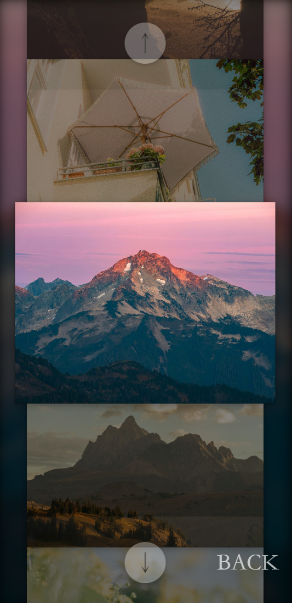
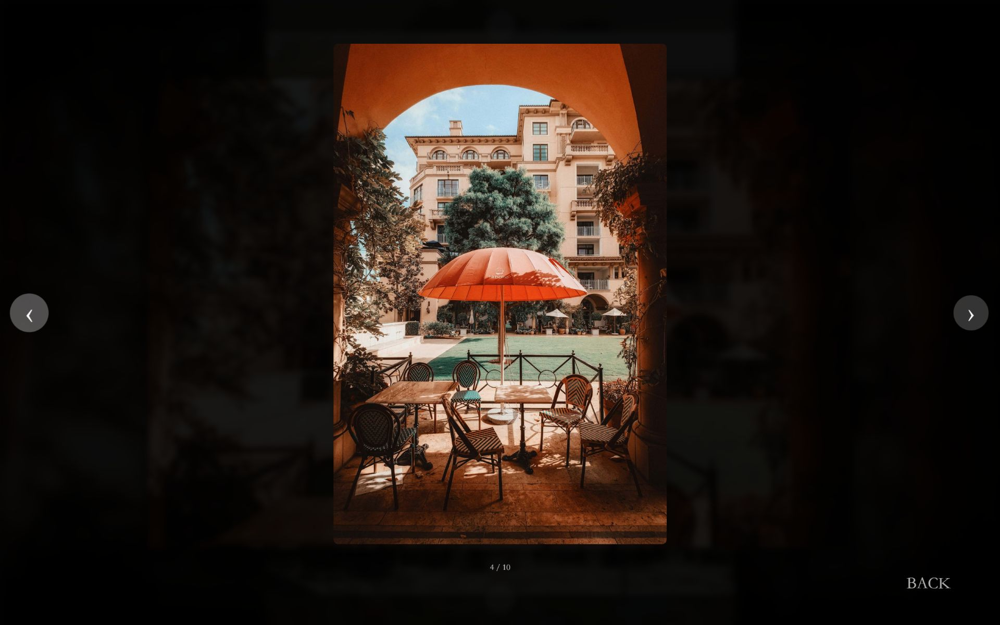
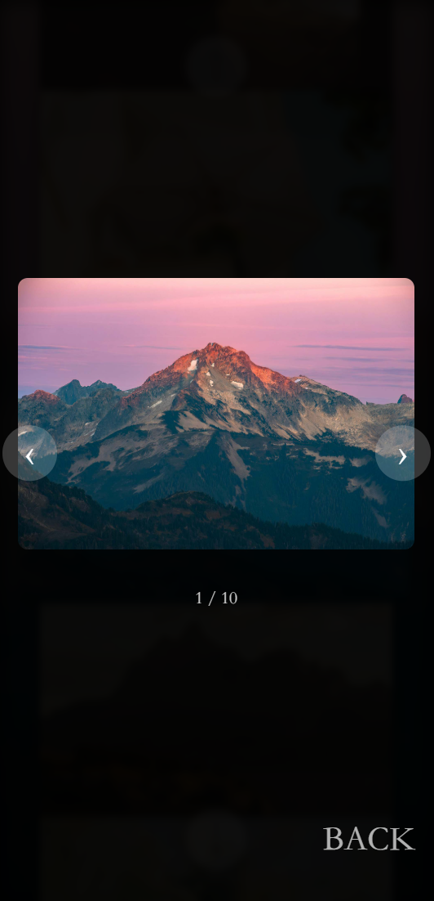

# Responsive-Image-Carousel-Gallery / 响应式图片轮播画廊

[English](#english) | [中文](#中文)

---

## English <a id="english"></a>

A gallery template built with Vue.js, featuring a minimalist and elegant design with blur effects to create depth in the visual space. Optimized for both mobile and desktop browsers to deliver an immersive browsing experience.

For better browsing performance, it's recommended to compress images before use.

### Main Features

Implements multi-catalog switching, drag sliding, scroll sliding, and button navigation.

### Mobile Adaptation


### Interface Display

| Interface | Desktop | Mobile |
|--------|--------|--------|
| Homepage |  |  |
| Gallery |  |  |
| Details |  |  |

### Usage

To create a new category "new-photos":

#### Adding a New Gallery
1. Create a new folder "new-photos" in `victorimagery/src/assets`
2. Add your images numbered sequentially: "1.jpg", "2.jpg", etc.

#### Adding a Cover Image
Add a cover image "cover3.jpg" for the new category in `victorimagery/src/assets/covers`

#### Creating New Vue File
Create `new-photos.vue` in `victorimagery/src/views` following the structure of `catalogue1.vue`:

```vue
<template>
  <CommonCarousel :images="cards" />
</template>

<script>
import CommonCarousel from '@/components/CommonCarousel.vue'

export default {
  name:'new-photos',
  components: {
    CommonCarousel
  },
  data() {
    return {
      cards: [
        {
          src: require('../assets/new-photos/1.jpg'),
          alt: '1.jpg'
        },
        // Add more images as needed...
      ]
    }
  }
}
</script>
```

#### Adding Category Entry
Add the new category to `victorimagery/src/views/HomeView.vue`:

```vue
<ul>
  <li @mouseenter="handleSwitchCover(0)" @click="goToPage('catalogue1')">catalogue1</li>
  <li @mouseenter="handleSwitchCover(1)" @click="goToPage('catalogue2')">catalogue2</li>
  <li @mouseenter="handleSwitchCover(2)" @click="goToPage('catalogue3')">catalogue3</li>
  <li @mouseenter="handleSwitchCover(2)" @click="goToPage('new-photos')">new photos</li>
</ul>
```

#### Adding Cover Image Reference
Update the script section in `HomeView.vue`:

```vue
goToPage(pageName) {
  const routeMap = {
    'catalogue1': '/catalogue1',
    'catalogue2': '/catalogue2', 
    'catalogue3': '/catalogue3',
    'new-photos': '/new-photos',  // Add this line
    'about': '/about',
    'contact': '/contact',
    'produce': '/produce'
  };
```

```vue
coverImages: [
  require('../assets/covers/封面0.jpg'),
  require('../assets/covers/封面1.jpg'), 
  require('../assets/covers/封面2.jpg'),
  require('../assets/covers/封面3.jpg'),  // Add this line
],
```

#### Adding Route Configuration
Add the route in `victorimagery/src/router/index.js`:

```javascript
{
  path:'/new-photos',
  name:'new-photos', 
  component: () => import(/* webpackChunkName: "about" */ '../views/new-photos.vue')
},
```

### Project Setup

#### Installation
```bash
npm install
```

#### Development Server
```bash
npm run serve
```

#### Production Build
```bash
npm run build
```

#### Custom Configuration
See [Configuration Reference](https://cli.vuejs.org/config/).

---

## 中文 <a id="中文"></a>

本画廊模板使用 Vue.js 框架搭建，画面风格简约优雅，采用模糊效果扩展视觉深度空间，并针对移动和桌面浏览器进行了适配与优化，打造沉浸式浏览体验。

为了更好的浏览体验，推荐您将图像进行压缩后再投入使用。

### 主要功能演示

实现了多目录切换、拖拽滑动、滚动滑动、按钮滑动。

### 移动端适配


### 界面展示

| 界面 | 桌面端 | 移动端 |
|--------|--------|--------|
| 首页 |  |  |
| 画廊 |  |  |
| 详情 |  |  |

### 使用方法

以创建新类别 "new-photos" 为例：

#### 添加新图库
1. 在 `victorimagery/src/assets` 创建新图库文件夹 "new-photos"
2. 将图片按照序号命名为 "1.jpg"、"2.jpg"…

#### 添加封面
在 `victorimagery/src/assets/covers` 里添加新栏目的封面 "cover3.jpg"

#### 创建新文件
在 `victorimagery/src/views` 里模仿 "catalogue1.vue" 添加 "new-photos.vue"：

```vue
<template>
  <CommonCarousel :images="cards" />
</template>

<script>
import CommonCarousel from '@/components/CommonCarousel.vue'

export default {
  name:'new-photos',
  components: {
    CommonCarousel
  },
  data() {
    return {
      cards: [
        {
          src: require('../assets/new-photos/1.jpg'),
          alt: '1.jpg'
        },
        // 根据需要添加更多图片...
      ]
    }
  }
}
</script>
```

#### 添加新目录入口
打开 `victorimagery/src/views/HomeView.vue`，增加新目录：

```vue
<ul>
  <li @mouseenter="handleSwitchCover(0)" @click="goToPage('catalogue1')">catalogue1</li>
  <li @mouseenter="handleSwitchCover(1)" @click="goToPage('catalogue2')">catalogue2</li>
  <li @mouseenter="handleSwitchCover(2)" @click="goToPage('catalogue3')">catalogue3</li>
  <li @mouseenter="handleSwitchCover(2)" @click="goToPage('new-photos')">new photos</li>
</ul>
```

#### 添加封面入口
在 `HomeView.vue` 的 script 部分添加对应配置：

```vue
goToPage(pageName) {
  const routeMap = {
    'catalogue1': '/catalogue1',
    'catalogue2': '/catalogue2',
    'catalogue3': '/catalogue3',
    'new-photos': '/new-photos',  // 添加这行
    'about': '/about',
    'contact': '/contact',
    'produce': '/produce'
  };
```

```vue
coverImages: [
  require('../assets/covers/封面0.jpg'),
  require('../assets/covers/封面1.jpg'),
  require('../assets/covers/封面2.jpg'),
  require('../assets/covers/封面3.jpg'),  // 添加这行
],
```

#### 添加对应网页路由
打开 `victorimagery/src/router/index.js`，添加路由配置：

```javascript
{
  path:'/new-photos',
  name:'new-photos',
  component: () => import(/* webpackChunkName: "about" */ '../views/new-photos.vue')
},
```

### 项目初始化

#### 安装依赖
```bash
npm install
```

#### 编译并热重载（开发环境）
```bash
npm run serve
```

#### 编译并压缩（生产环境）
```bash
npm run build
```

#### 自定义配置
详见 [配置参考](https://cli.vuejs.org/config/)。